# Buscador Inteligente Roca — Documentación del proyecto

> Documentación técnica completa del PoC de e-commerce con búsqueda inteligente construido durante el hackathon (1–2 de julio de 2026).
> Está organizada **de lo general a lo específico**: visión general → arquitectura → servicios → buscadores → features → datos → decisiones de diseño → dependencias y licencias → configuración → seguridad.

---

## Índice

1. [Visión general](#1-visión-general)
2. [Arquitectura](#2-arquitectura)
3. [Inventario de servicios](#3-inventario-de-servicios)
4. [Los buscadores: cómo funcionan y en qué orden llaman a los servicios](#4-los-buscadores)
5. [Features: lista completa con diagramas de flujo](#5-features)
6. [API: endpoints del backend](#6-api-endpoints-del-backend)
7. [Datos: ficheros y pipelines de construcción](#7-datos-ficheros-y-pipelines)
8. [Decisiones de diseño](#8-decisiones-de-diseño)
9. [Dependencias y licencias](#9-dependencias-y-licencias)
10. [Configuración: variables de entorno](#10-configuración-variables-de-entorno)
11. [Despliegue](#11-despliegue)
12. [Seguridad y limitaciones conocidas](#12-seguridad-y-limitaciones-conocidas)
13. [Cronología del proyecto](#13-cronología-del-proyecto)

---

## 1. Visión general

**Qué es**: un buscador/e-commerce inteligente sobre el catálogo de Roca (15.408 productos, 9.501 modelos, 54.945 relaciones entre productos) que combina búsqueda semántica, interpretación de lenguaje natural con LLM, búsqueda por imagen, chat asistente agéntico, generación de ambientes con IA y compra online/offline.

**Estructura del monorepo**:

```
HackatonDev/
├── backend/          API FastAPI (Python 3) → se despliega en Railway
│   └── data/         JSON del catálogo cargados en memoria (generados offline)
├── frontend/         SPA React 18 + Vite 5 + TypeScript 5 → se despliega en Vercel
├── tools/            Scripts de construcción de datos y pruebas manuales
├── docs/superpowers/ Specs de diseño y planes de implementación (flujo spec → plan → TDD)
└── testfiles/        Muestras de trabajo y notebook de procesado de blobs (no versionado)
```

**Capacidades principales**:

| Capacidad | Tecnología central |
|---|---|
| Búsqueda de texto semántica + facetas dinámicas | LLM (gpt-5.4) + Azure AI Search híbrido + postprocesado local |
| Interpretación de lenguaje natural ("lavabos negros baratos") | LLM gpt-5.4 en Azure AI Foundry (Responses API) |
| Búsqueda por imagen (1–6 fotos) | DINOv2 en Azure ML Online Endpoint |
| Chat asistente con herramientas | Claude claude-sonnet-5 (Anthropic vía Azure AI Foundry) |
| Documentación de producto (manuales) | Pipeline OCR con LLM de visión + RAG sobre Azure AI Search |
| "Diseña tu baño" (render IA) | gpt-image-2 en Azure AI Foundry |
| Compra online (carrito) / offline (distribuidores) | localStorage + 861 puntos de venta reales geolocalizados |
| Integración con Claude Desktop | Servidor MCP por stdio (FastMCP) |

**Principio transversal**: *toda funcionalidad de IA es opcional*. Los módulos de IA se importan con `try/except`; si falta un SDK o una clave, la app arranca igual, `GET /health` expone flags (`chat_ready`, `image_ready`, `design_ready`) y el frontend oculta los controles correspondientes. La búsqueda básica funciona siempre (con fallback local si Azure cae).

---

## 2. Arquitectura

### 2.1 Diagrama de arquitectura de servicios

```mermaid
flowchart TB
    subgraph Cliente["Navegador (Vercel)"]
        FE["SPA React + Vite + TS<br/>App.tsx · api.ts"]
        WSA["Web Speech API<br/>(dictado por voz)"]
        GEO["Geolocation API"]
        LEAF["Leaflet 1.9.4 (CDN)<br/>+ tiles OpenStreetMap"]
        LS["localStorage<br/>(carrito roca_cart_v1)"]
    end

    subgraph Backend["Backend FastAPI (Railway) — main.py"]
        SEARCH["/search<br/>facetas + agrupación por modelo"]
        SUGGEST["/suggest<br/>autocompletado"]
        IMG["/search/image"]
        CHAT["/api/chat (NDJSON stream)"]
        DESIGN["/api/design · /analyze"]
        SUP["/suppliers · /nearby"]
        PROD["/products/sku · /recommend"]
        MEM[("Catálogo en memoria<br/>products · relations · images<br/>websort · suppliers · concepts")]
    end

    subgraph Azure["Servicios en Azure"]
        AIS["Azure AI Search<br/>índice rag-test4 (catálogo)<br/>índice manuales-test (OCR)"]
        AOAI["Azure OpenAI<br/>text-embedding-3-large-2<br/>3072 dims"]
        FOUNDRY["Azure AI Foundry — GPT<br/>gpt-5.4 / gpt-5.4-nano<br/>(Responses API)"]
        CLAUDE["Azure AI Foundry — Anthropic<br/>claude-sonnet-5<br/>(Messages API)"]
        GPTIMG["Azure AI Foundry<br/>gpt-image-2<br/>(images/edits · generations)"]
        DINO["Azure ML Online Endpoint<br/>DINOv2 dino-embedder-roca"]
        BLOB["Azure Blob Storage<br/>PDFs manuales + .md OCR"]
    end

    MCP["Servidor MCP roca-catalog<br/>(stdio, Claude Desktop)"]
    CLD["Cloudinary (DAM Roca)<br/>fotos de producto"]

    FE --> SEARCH & SUGGEST & IMG & CHAT & DESIGN & SUP & PROD
    FE --> LS
    WSA --> FE
    GEO --> SUP
    LEAF --> FE
    FE -.imágenes.-> CLD

    SEARCH --> FOUNDRY
    SEARCH --> AOAI
    SEARCH --> AIS
    SEARCH --> MEM
    SUGGEST --> MEM
    IMG --> DINO
    IMG --> MEM
    CHAT --> CLAUDE
    CHAT -->|tool search_catalog| SEARCH
    CHAT -->|tool search_manual| AIS
    CHAT -->|SAS pdf_url| BLOB
    DESIGN --> GPTIMG
    DESIGN --> CLAUDE
    DESIGN -.fotos referencia.-> CLD

    MCP -->|reutiliza main.search etc.| Backend
```

### 2.2 Diagrama de despliegue

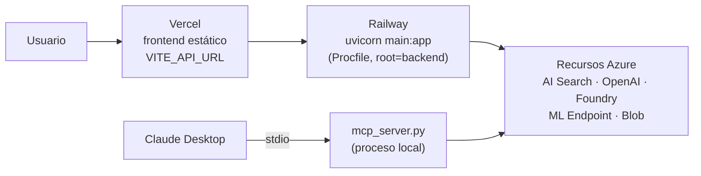

### 2.3 Patrones de arquitectura del backend

- **Monolito FastAPI con catálogo en memoria**: `main.py` (~1.020 líneas) carga todos los JSON de `backend/data/` en *import time* y construye índices (`BY_SKU`, `BY_MODEL`, `MODEL_COMPACT`, `SEARCH_INDEX`, `COLOR_FINISHES`…). No hay base de datos.
- **Módulos hoja que aíslan cada dependencia externa**: `azure_search.py` (AI Search + embeddings + LLM), `image_search.py` (DINO), `search_ocr.py` (manuales), `design.py` (gpt-image), `chat.py` (Claude). Todos con el mismo patrón: cliente perezoso y carga de `backend/.env` sin pisar variables ya definidas (en producción mandan las del panel de Railway). Cada uno expone su disponibilidad a su manera: `image_search.ready()`, `design.READY`, `chat.API_KEY`; para `azure_search` basta con que el import funcione.
- **Inyección de dependencias hacia dentro**: `chat.configure(search)` y `design.configure(BY_SKU, IMAGES, summary, search)` reciben la **misma función `search()`** del endpoint — el motor de búsqueda es la única fuente de verdad para el chat y el diseño.
- **Degradación en cascada**: import opcional → cliente perezoso → excepción capturada → fallback local (búsqueda por substring, análisis léxico sin LLM).

---

## 3. Inventario de servicios

### 3.1 Servicios cloud (de pago, por consumo)

| Servicio | Tipo | Para qué se usa | Config principal |
|---|---|---|---|
| **Azure AI Search** | Búsqueda vectorial/híbrida | Motor de relevancia de `/search` (índice `rag-test4`, un chunk por producto) y RAG de manuales (`manuales-test`); `ocr-catalogos` es el índice que crea el script de indexación push | `AZURE_SEARCH_ENDPOINT/KEY/INDEX`, `AZURE_SEARCH_OCR_INDEX`, `AZURE_SEARCH_K=120` |
| **Azure OpenAI (embeddings)** | Embeddings de texto | Vectoriza la query en `/search` y las páginas OCR al indexar/buscar manuales. Deployment `text-embedding-3-large-2`, **3072 dimensiones**, API `2024-10-21` | `AZURE_OPENAI_ENDPOINT/KEY`, `AZURE_EMBED_DEPLOYMENT`, `AZURE_EMBED_DIMENSIONS` |
| **Azure AI Foundry — GPT** | LLM (Responses API, cliente OpenAI v1) | 3 usos: (1) intérprete de la query de `/search` (`analyze_query`), (2) **OCR con visión** de los PDFs de manuales página a página, (3) respuesta RAG del CLI de manuales. Deployment `gpt-5.4` (default en código) / `gpt-5.4-nano` (.env.example) | `FOUNDRY_ENDPOINT`, `FOUNDRY_API_KEY`, `FOUNDRY_DEPLOYMENT` |
| **Azure AI Foundry — Anthropic Claude** | LLM agéntico + visión | Chat "Búsqueda IA" (bucle de tool-use con streaming) y análisis de la foto del baño en "Renueva tu baño". Modelo `claude-sonnet-5`, cliente `AsyncAnthropicFoundry` | `CLAUDE_API_KEY`, `CLAUDE_ENDPOINT`, `CLAUDE_DEPLOYMENT` |
| **Azure AI Foundry — gpt-image-2** | Generación/edición de imagen | "Diseña tu baño": `POST /openai/v1/images/edits` (con referencias, `input_fidelity=high`) o `/images/generations` (desde cero). Llamado por REST con httpx, timeout 600 s | `IMAGE_DEPLOYMENT=gpt-image-2`, `IMAGE_SIZE=1536x1024`, `IMAGE_QUALITY=medium`, `IMAGE_ENDPOINT/KEY` |
| **Azure ML Online Endpoint — DINOv2** | Búsqueda visual | `dino-embedder-roca.spaincentral.inference.ml.azure.com/score`: recibe `{image_b64, top_k}` y devuelve los SKUs más parecidos con score coseno. **El índice de embeddings del catálogo vive dentro del endpoint**, no en el repo. 1 instancia (facturación por instancia) | `IMAGE_SEARCH_API_KEY`, `IMAGE_SEARCH_SCORING_URI` |
| **Azure Blob Storage** | Almacenamiento de objetos | Origen de los PDFs de manuales (contenedor `data`, prefijo `products/products_documents/`), destino de los `.md` del OCR, y firma **SAS** temporal (2 h) de los `pdf_url` que cita el chat | `AZURE_STORAGE_CONNECTION_STRING`, `OCR_SOURCE_CONTAINER/PREFIX` |
| **Railway** | PaaS (hosting backend) | Despliegue del backend (`Procfile: web: uvicorn main:app --host 0.0.0.0 --port $PORT`) | Variables del panel |
| **Vercel** | Hosting estático (frontend) | Build de Vite; `VITE_API_URL` apunta a Railway | `VITE_API_URL` |

### 3.2 Servicios gratuitos / locales / del navegador

| Servicio | Tipo | Para qué se usa |
|---|---|---|
| **model2vec** (`minishlab/M2V_multilingual_output`, descargado de Hugging Face) | Embeddings estáticos locales (numpy puro, sin torch) | Autocompletado semántico de `/suggest`. **Desactivado por defecto** (`ENABLE_SEMANTIC=0`) porque su carga provocaba OOM/crash-loop en Railway |
| **Buscador fallback por substring** | Índice local en memoria (`SEARCH_INDEX`) | Sustituye a Azure AI Search si el módulo no carga o la llamada falla |
| **Servidor MCP** (`mcp_server.py`, FastMCP) | Protocolo local por stdio | Expone el catálogo a Claude Desktop; reutiliza el backend sin red |
| **Cloudinary (DAM de Roca)** | CDN de imágenes | URLs públicas de fotos de producto (`images.json`); sin credenciales en runtime |
| **Leaflet 1.9.4 + OpenStreetMap** | Mapa (CDN unpkg, sin npm ni API key) | Mapa de distribuidores; degrada a lista si el CDN falla |
| **Web Speech API** | API del navegador | Dictado por voz (es-ES) en buscador y chat; solo reconocimiento, no TTS |
| **Geolocation API** | API del navegador | Ubicación para `/suppliers/nearby`; fallback manual a Barcelona |
| **Canvas / createImageBitmap** | API del navegador | Reescalado de fotos en cliente antes de subirlas (1024 px / 1600 px) |

### 3.3 Modelos de IA en uso (resumen)

| Modelo | Dónde corre | Rol |
|---|---|---|
| `gpt-5.4` / `gpt-5.4-nano` | Azure AI Foundry (Responses API) | Intérprete de queries, OCR de visión, RAG CLI |
| `text-embedding-3-large` (deployment `text-embedding-3-large-2`) | Azure OpenAI | Embeddings de texto (catálogo y manuales), 3072 dims |
| `claude-sonnet-5` | Azure AI Foundry (Anthropic) | Chat agéntico + análisis de foto del baño |
| `gpt-image-2` | Azure AI Foundry | Render/edición de imágenes "Diseña tu baño" |
| DINOv2 | Azure ML Online Endpoint | Similitud visual foto → SKUs del catálogo |
| model2vec `M2V_multilingual_output` | Local (numpy) | Autocompletado semántico (opcional) |

---

## 4. Los buscadores

Esta es la parte central del sistema. Hay **cuatro vías de búsqueda** (texto, autocompletado, imagen, manuales) más el **chat agéntico** que las orquesta.

### 4.1 Búsqueda de texto — `GET /search`

**Orden exacto de llamadas** (con `q` y `auto=1`, que es lo que envía el frontend en una búsqueda nueva):

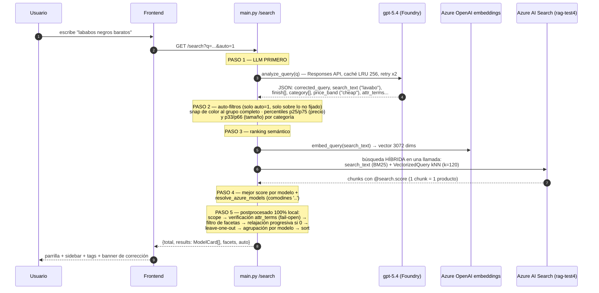

Detalle de cada paso:

1. **LLM primero** (`azure_search.analyze_query`, gpt-5.4 vía Responses API, `max_output_tokens=8000`): corrige erratas y separa *qué producto se busca* (`search_text`) de *qué atributos son filtros* (`finish`, `category`, `collection`, `min/max_price`, `price_band`, `size`, `sort`, `attr_terms`). El vocabulario **real** del catálogo (acabados, categorías, colecciones) se inyecta en el prompt con `set_vocab()` y la salida se valida contra él: un valor inexistente se descarta. Caché LRU de 256 queries; reintento ×2 porque el content filter de Azure trunca el JSON de forma no determinista.
2. **Auto-filtros** (solo con `auto=1`; el chat y las re-consultas de facetas van sin `auto`): se aplican únicamente sobre parámetros que el llamador no fijó. Los colores simples se "snapean" al grupo de color completo (`"dorados"` → todos los acabados del color Dorado aunque ninguno contenga la palabra). El precio cualitativo (`"baratos"` → banda ≤p25 de la categoría) y el tamaño (`"grande"` → p66+ por dimensión) se resuelven con **percentiles reales por categoría**, no con umbrales fijos.
3. **Azure AI Search después**: `search_models(q, k=120, q_eff=search_text)` embebe el texto interpretado (Azure OpenAI, 3072 dims) y lanza **una única llamada híbrida** (keyword BM25 + kNN vectorial sobre `text_vector`; la fusión la hace Azure — no hay semantic ranker configurado). `k=120` alto a propósito: las facetas se calculan sobre el conjunto devuelto. Sin caché: cada llamada golpea Azure (frescura y depurabilidad).
4. **Resolución de modelos**: el índice titula los modelos "compactados" (sin los puntos comodín: `857853` en vez de `857853...`); `MODEL_COMPACT` los traduce al modelo canónico. Sin este mapa se perdían familias enteras (~105/120 resultados de mobiliario).
5. **Postprocesado local** (todo en memoria, sin más llamadas):
   - **Scope**: solo los modelos devueltos por Azure (excluyendo recambios salvo `include_spare=1`).
   - **Verificación de atributos técnicos** (*fail-open*): los `attr_terms` del LLM ("antideslizante", "extraplano") se verifican por substring (con variantes de plural/género) contra el texto real de cada producto; si ninguno los cumple, se ignoran.
   - **Filtro de facetas**: OR dentro de cada faceta, AND entre facetas.
   - **Relajación progresiva**: si los auto-filtros dejan 0 resultados, se retiran uno a uno (`category → collection → size → min_price → max_price → finish` — primero lo inferido, al final lo pedido con palabras).
   - **Facetas leave-one-out**: cada faceta se cuenta aplicando todas las demás menos la suya (para poder ampliar la selección); los contadores cuentan **modelos**, no SKUs.
   - **Agrupación por modelo**: una tarjeta por modelo con sus variantes de acabado como thumbnails (las variantes ignoran el filtro de color).
   - **Ordenación**: `relevance` (score) | `websort` (orden del escaparate de roca.es) | `price_asc/desc` | `alpha_asc/desc`.

**Fallbacks del buscador de texto** (en cascada):

| Fallo | Comportamiento |
|---|---|
| SDK de Azure no instalado / import falla | Motor `fallback-substring` local sobre `SEARCH_INDEX` |
| LLM caído / content filter / JSON ilegible / `AZURE_LLM_REFINE=0` | `_local_analysis`: detección léxica de colores contra el catálogo, sin corrección de erratas |
| Azure AI Search falla en runtime | Fallback substring (score = tokens presentes + bonus por título) |
| Auto-filtros dejan 0 resultados | Relajación progresiva |
| `attr_terms` que ningún producto cumple | Se ignoran (fail-open) |
| `websort.json` ausente | `sort=websort` degrada al orden previo |

### 4.2 Autocompletado — `GET /suggest`

Sin LLM ni red: `parse_query()` local detecta calificador de precio (con bigramas, "gama alta"), color (`color_lexicon`) y textura → filtro `finish`; sugiere conceptos por **prefijo** sobre los términos de intención (top 6) y, solo con `ENABLE_SEMANTIC=1`, por **similitud coseno** con model2vec contra `concept_vectors.npy` (umbral 0.35, top 8). Debounce de 180 ms en el frontend.

### 4.3 Búsqueda por imagen — `POST /search/image`

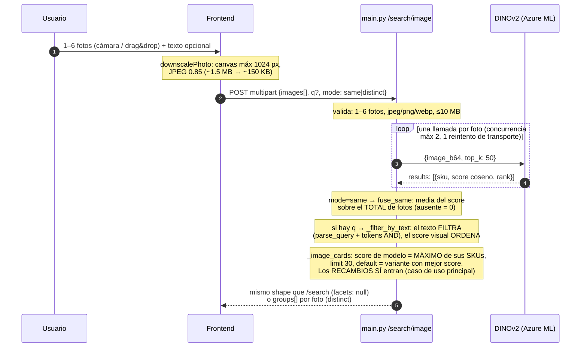

Puntos clave:
- El endpoint DINOv2 **ya hace la búsqueda de vecinos**: devuelve SKUs con score, no un vector. El índice de embeddings del catálogo vive dentro del servicio en Azure ML.
- Los scores de DINOv2 vienen comprimidos (0.5–0.9): solo son comparables entre candidatos, por eso **no hay umbral absoluto** ni % de confianza en la UI.
- Dos modos: `same` (todas las fotos son el mismo producto → fusión de rankings) y `distinct` (un ranking por foto → secciones separadas en la UI).
- La API key del endpoint nunca llega al navegador (proxy en el backend).

### 4.4 Búsqueda de manuales (RAG OCR) — tool `search_manual`

No tiene endpoint REST propio: se expone solo como **herramienta del chat** (`/api/chat`) y como **tool MCP**. Consulta el índice `manuales-test` de Azure AI Search:

- **Con pregunta** (modo QA): embedding de la pregunta (Azure OpenAI) + búsqueda **híbrida** (BM25 + kNN) + **filtro OData** por `sku` y `doctype` → top 6 fragmentos (máx 1.200 caracteres cada uno).
- **Sin pregunta** (documento completo): `search_text="*"` + filtro + `order_by page asc` → hasta 40 páginas agrupadas por PDF (máx 4.000 caracteres/página).
- **Resolución tolerante del identificador**: se prueban en orden SKU tal cual → SKU sin el primer carácter (prefijo de mercado: `A812429000` → `812429000`) → modelo con puntos comodín (`212106..1`) → modelo sin puntos finales.
- Cada `pdf_url` se firma con un **SAS de solo lectura (TTL 2 h)** para que el chat cite enlaces clicables a los PDF del blob privado.

(El pipeline de indexación OCR que alimenta este índice se describe en [§7.3](#73-pipeline-ocr-de-manuales-offline).)

### 4.5 El chat agéntico y el orden en que orquesta los buscadores

El chat (`/api/chat`) es **Claude claude-sonnet-5** con 4 herramientas, en un bucle de tool-use de hasta **12 iteraciones** por mensaje, con doble streaming (SDK Anthropic → eventos NDJSON al navegador):

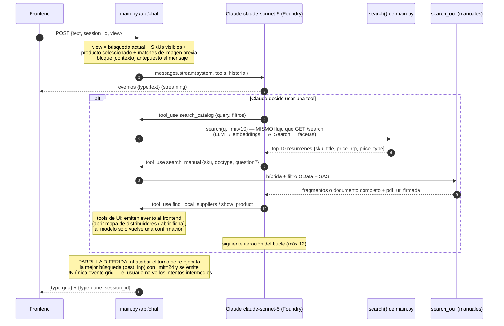

Decisiones clave del chat:
- **El schema de `search_catalog` se deriva por introspección** de la firma de `main.search()`: cualquier filtro nuevo del buscador queda disponible para el agente sin tocar `chat.py`.
- **Regla de compra por `price_type`**: `OnlineFrom` → `show_product` (la ficha tiene el botón "Comprar online" que añade al carrito); `PVPR` → `find_local_suppliers` (distribuidor físico). No existe tool `add_to_cart` en el backend: el carrito es estado del frontend.
- **Historial en memoria** por `session_id` (máx 200 sesiones, poda FIFO), con *rollback* del turno completo si la API de Claude falla.
- El system prompt instruye: colores/materiales van en el **texto** de la query (no como filtro `finish`, que es exacto y case-sensitive); dimensiones en **milímetros**; nunca inventar productos, precios ni tiendas.

### 4.6 Resumen: orden LLM ↔ AI Search según la vía de entrada

| Vía | Orden de llamadas |
|---|---|
| Búsqueda de texto (`auto=1`) | **1º LLM** (interpreta/corrige) → **2º** embedding → **3º** AI Search híbrido → postprocesado local |
| Refinar facetas / ordenar | LLM (caché) → embedding → AI Search (mismo texto, sin auto-filtros nuevos) |
| Chat | **1º Claude** decide → **2º** tool `search_catalog` → dentro: LLM gpt-5.4 → embedding → AI Search → **3º** Claude redacta |
| Imagen | **solo DINOv2** (sin LLM ni AI Search); el texto opcional filtra en local |
| Imagen + "Búsqueda IA" | 1º DINOv2 → 2º los matches viajan como contexto → 3º Claude (que puede lanzar `search_catalog`) |
| Manuales | Claude → tool `search_manual` → embedding + AI Search (índice OCR) + SAS |
| Autocompletado | Solo local (prefijo; embeddings model2vec opcionales) |

---

## 5. Features

Lista completa de funcionalidades, cada una con su diagrama de flujo.

### 5.1 Búsqueda con facetas dinámicas e intérprete de lenguaje natural

La feature estrella. Facetas: Categoría, Colecciones, **Colores** (acabados agrupados en 18 colores principales), Precio (slider doble) y Dimensiones (3 sliders largo/ancho/alto).

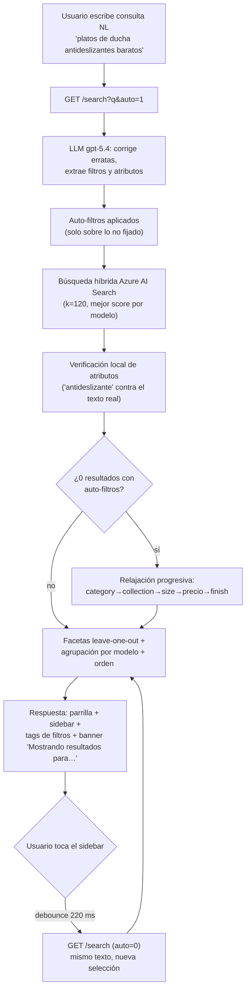

- El banner de corrección ofrece "Buscar en su lugar por *la query literal*" (relanza con `literal=true` para que el LLM no re-corrija).
- Semántica de filtros: **OR dentro de una faceta, AND entre facetas**; contadores leave-one-out para que las opciones hermanas sigan visibles.

### 5.2 Agrupación de la parrilla por modelo

1.754 de los 9.501 modelos tienen más de una variante de acabado. En vez de N tarjetas casi idénticas, una tarjeta por modelo con swatches:

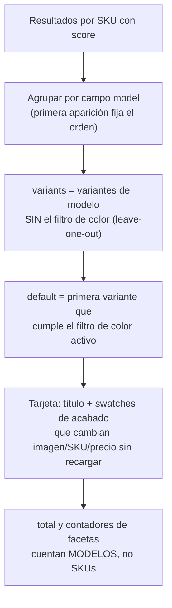

### 5.3 Autocompletado con conceptos

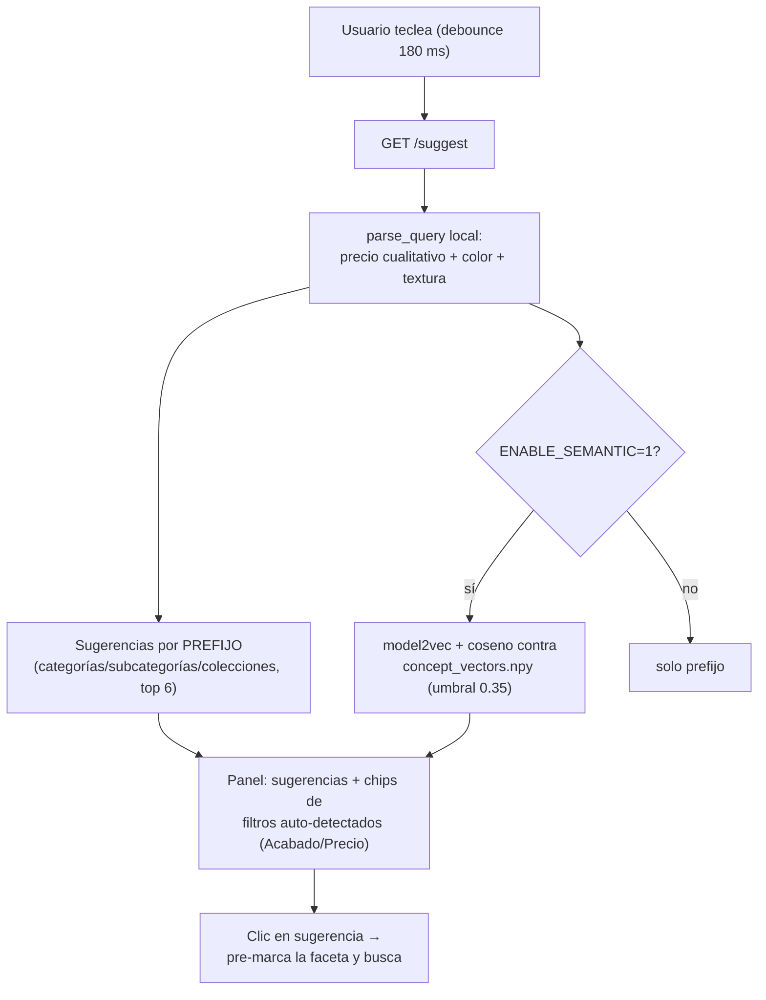

### 5.4 Búsqueda por voz

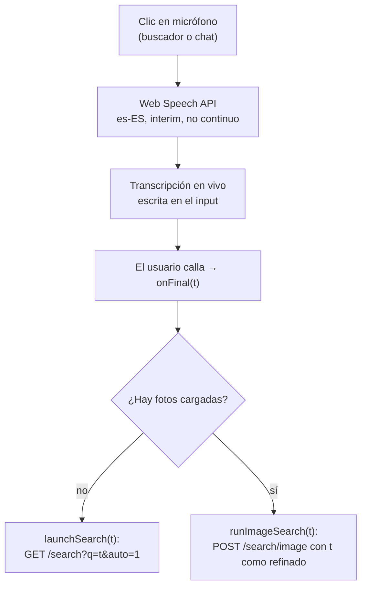

Solo dictado (no hay síntesis de voz). Requiere Chrome/Edge/Safari y HTTPS o localhost.

### 5.5 Búsqueda por imagen

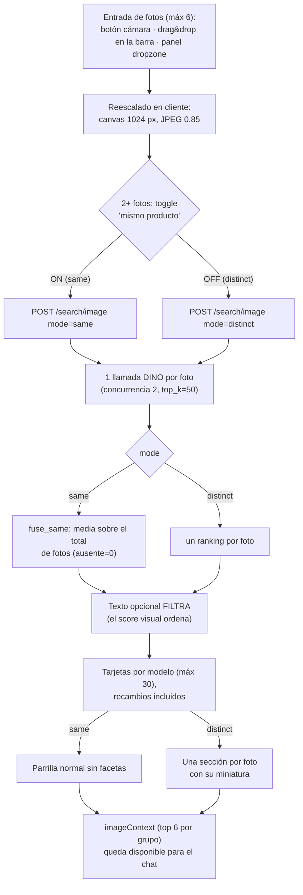

### 5.6 Chat "Búsqueda IA" (asistente agéntico)

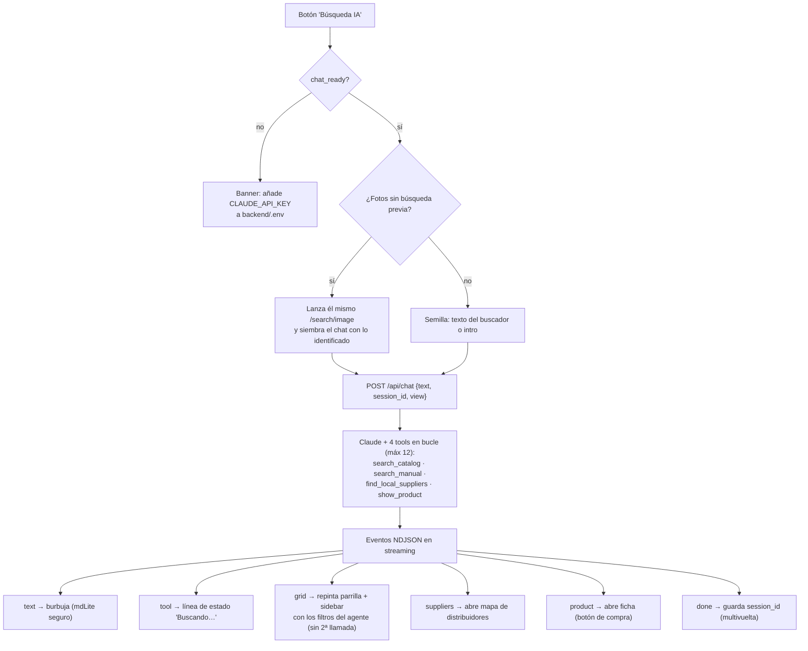

### 5.7 Documentación de producto (manuales)

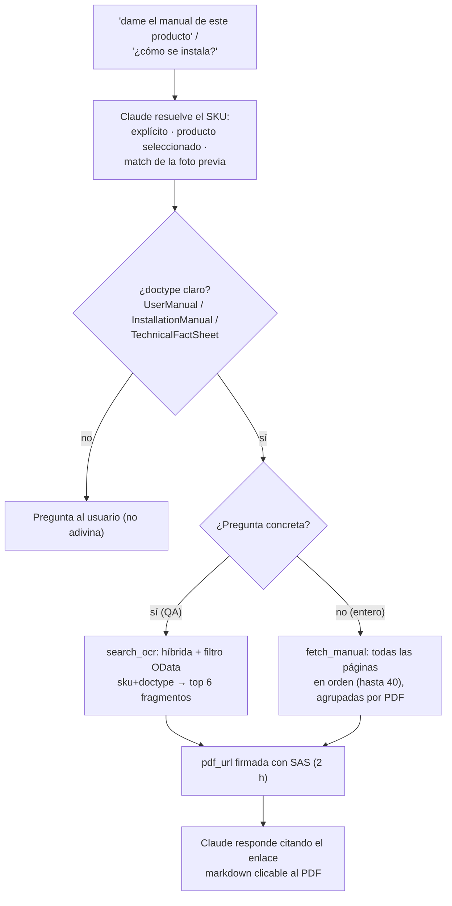

### 5.8 Ficha de producto, relaciones y recomendaciones

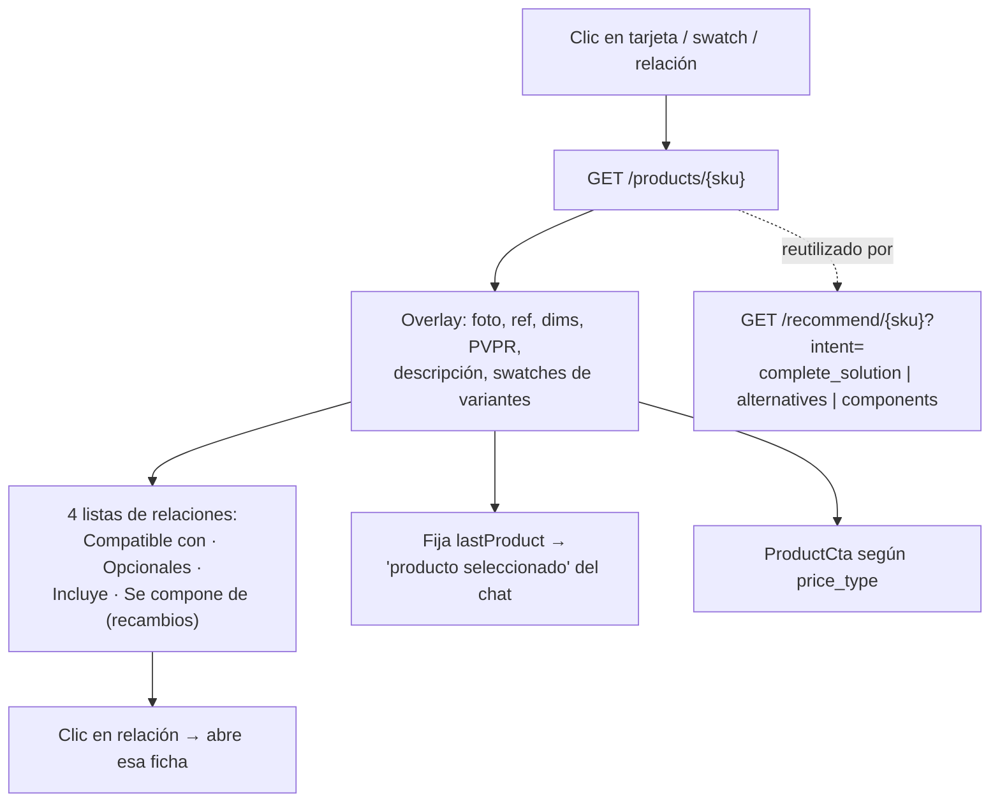

### 5.9 Comparador de productos

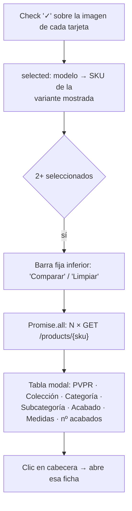

### 5.10 Carrito y compra online (simulada)

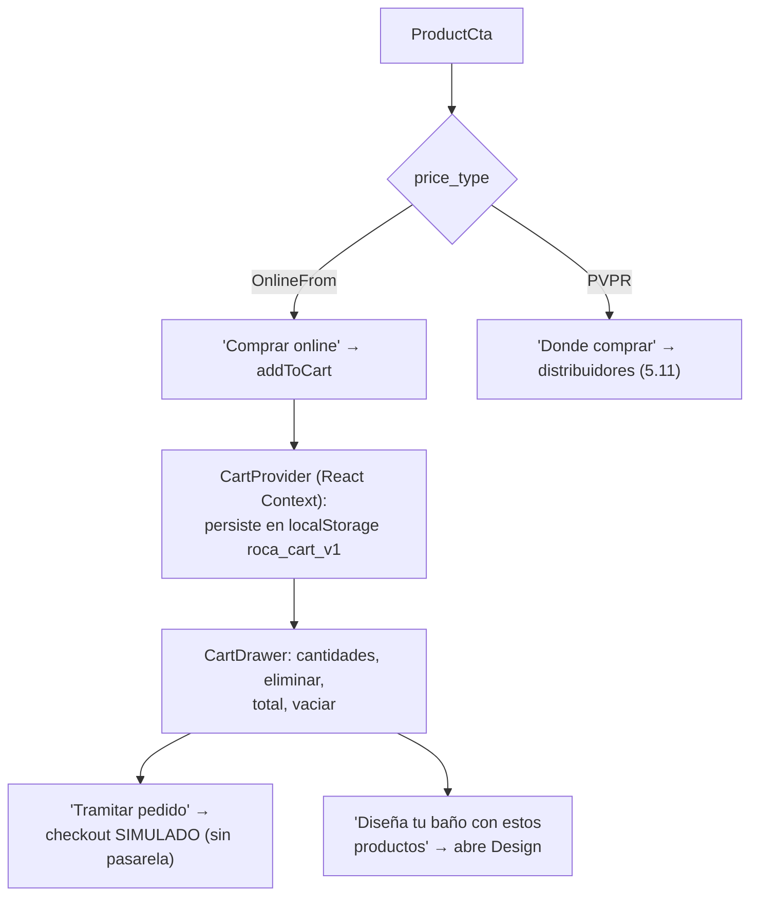

### 5.11 Distribuidores cercanos (compra offline)

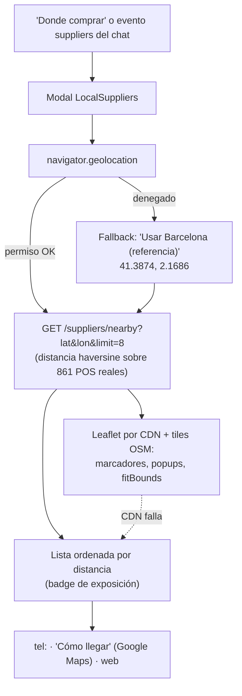

### 5.12 Diseña tu baño (render IA) + Renueva tu baño

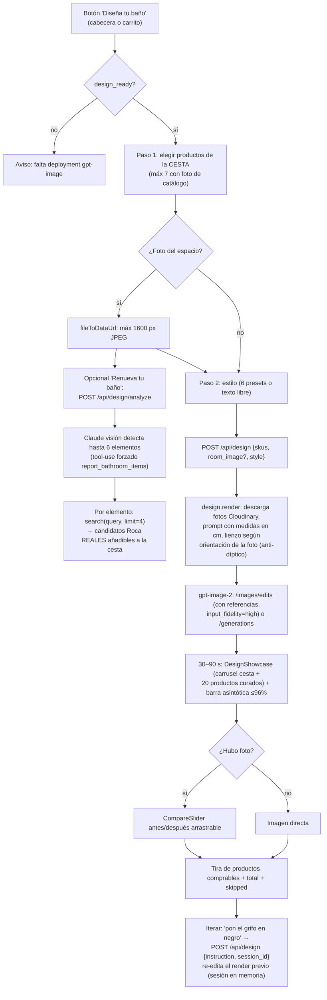

### 5.13 Servidor MCP (Claude Desktop)

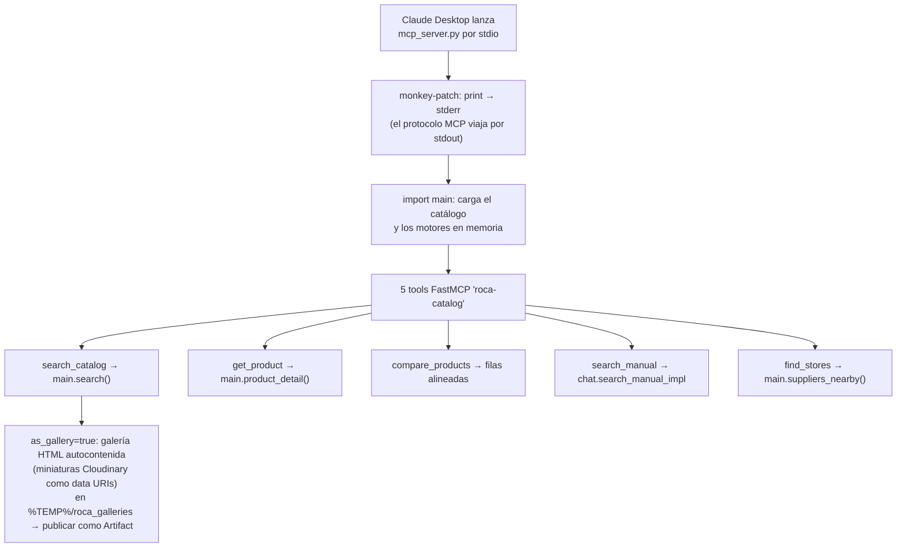

### 5.14 Feature flags y salud

`GET /health` devuelve `{status, products, relations_models, chat_ready, image_ready, design_ready}`. El frontend lo llama al arrancar y con ello decide: mostrar el botón cámara (`image_ready`), habilitar el chat con banner de demo si falta la clave (`chat_ready`) y habilitar el render (`design_ready`).

---

## 6. API: endpoints del backend

| Método | Ruta | Descripción | Implementación |
|---|---|---|---|
| GET | `/health` | Estado + feature flags (`chat_ready`, `image_ready`, `design_ready`) | `main.py:298` |
| GET | `/suggest?q=` | Autocompletado: sugerencias por prefijo/semánticas + filtros auto-detectados | `main.py:399` |
| GET | `/search` | Búsqueda principal: `q`, `limit=30`, `include_spare`, `auto`, `sort`, `subcategory`, `category[]`, `collection[]`, `finish[]`, rangos `min/max_price·length·width·height`. Devuelve tarjetas por modelo + facetas + bloque `auto` | `main.py:529` |
| POST | `/search/image` | Búsqueda visual: multipart `images` (1–6, ≤10 MB), `q` opcional, `mode=same\|distinct`. Errores 400/502/503 | `main.py:1006` |
| POST | `/api/chat` | Chat agéntico en streaming NDJSON: eventos `text·tool·tool_error·grid·suppliers·product·done·error` | `main.py:1085` |
| POST | `/api/design` | Render "Diseña tu baño" (30–90 s); con `instruction`+`session_id` itera el render previo | `main.py:1063` |
| POST | `/api/design/analyze` | "Renueva tu baño": foto → elementos detectados + candidatos Roca | `main.py:1074` |
| GET | `/products/{sku}` | Ficha completa: variantes del modelo + relaciones (compatible/optional/included/sparepart) | `main.py:1106` |
| GET | `/suppliers/nearby?lat&lon&limit=8` | Puntos de venta por distancia haversine | `main.py:1140` |
| GET | `/suppliers` | Red completa de distribuidores | `main.py:1155` |
| GET | `/recommend/{sku}?intent=` | Recomendaciones: `complete_solution` (default) / `alternatives` / `components` | `main.py:1161` |

> Nota histórica: existió un endpoint `POST /interpret` (interpretación NL en dos viajes con gpt-5.4-nano); fue **retirado** en el merge de unificación NL a favor del intérprete único integrado en `/search?auto=1`.

---

## 7. Datos: ficheros y pipelines

### 7.1 Ficheros de `backend/data/` (cargados en memoria al arrancar)

| Fichero | Contenido | Generado por | ¿Obligatorio? |
|---|---|---|---|
| `products.json` (~25 MB) | 15.408 productos: campos normalizados (`sku`, `model`, `title`, `category`, `collection`, `finish`, `price_rrp`, `price_type`, `dims`…) + **todas** las columnas del Excel original | `tools/build_data.py` | Sí |
| `relations.json` (~8 MB) | `{model: [{type, code, ...}]}` — 54.945 relaciones compatible/optional/included/sparepart | `tools/build_data.py` | Sí |
| `images.json` | `{sku: url_cloudinary}` — solo fotos de producto (nunca planos técnicos) | `tools/build_images.py` | No |
| `websort.json` | `{model: posición}` — orden de escaparate de roca.es | `backend/build_websort.py` | No |
| `suppliers.json` | 861 puntos de venta geolocalizados (sin CIF ni emails internos) | `backend/build_suppliers.py` | No |
| `concepts.json` | Autocompletado: términos de intención, léxico de color, calificadores, bandas de precio p25/p75, acabados | `backend/build_concepts.py` | Sí |
| `concept_vectors.npy` | Embeddings model2vec normalizados de los términos de intención | `backend/build_concepts.py` | Solo con `ENABLE_SEMANTIC=1` |

### 7.2 Pipelines de construcción de datos (offline)

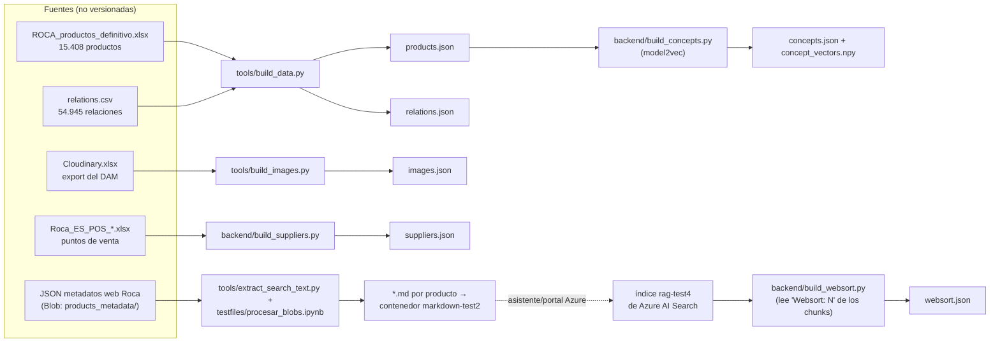

Detalles relevantes:
- `build_data.py` conserva **todas** las columnas del Excel además de los campos normalizados (decisión que habilitó después los CTAs de compra por `PriceType` sin regenerar datos). `relations.json` **no se reescribe** si falta el CSV fuente (no vaciar lo existente).
- `extract_search_text.py` hace un **curado agresivo** del texto para embeddings: blocklist de atributos ruidosos, descripciones solo si aportan ≥2 tokens nuevos, solo la categoría hoja, sin URLs ni `seoDescription`. El notebook `procesar_blobs.ipynb` aplica esa extracción a los JSON de metadatos del blob y sube los `.md` resultantes al contenedor `markdown-test2` (eslabón previo al índice semántico).
- `build_websort.py`: el orden del escaparate no viene en el Excel; viaja como línea `Websort: N` dentro del texto de cada chunk del índice, de donde se extrae con regex.

### 7.3 Pipeline OCR de manuales (offline)

**No se usa Azure Document Intelligence**: el "OCR" lo hace un **LLM multimodal** (gpt-5.4 en Foundry) porque los manuales de Roca son mayoritariamente pictogramas y planos acotados — el LLM no solo transcribe, sino que interpreta los pictogramas (broca Ø12, llave nº 17, pares de apriete) como instrucciones accionables en Markdown.

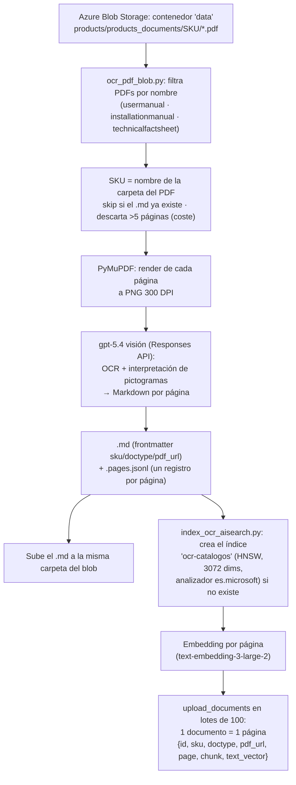

- **Chunking = 1 página del PDF** (unidad semántica natural de un manual; permite reconstruir el documento completo en orden).
- Modelo **push** (embeddings en cliente + upload), no indexer/skillset gestionado.
- Discrepancia consciente de nombres: el script crea `ocr-catalogos`, pero en runtime se consulta `AZURE_SEARCH_OCR_INDEX=manuales-test` (índice creado con el asistente del portal); por eso todos los nombres de campos son remapeables por variables `OCR_*_FIELD`.

---

## 8. Decisiones de diseño

### 8.1 Convenciones globales

| Decisión | Motivo |
|---|---|
| **Toda feature de IA es opcional** (import `try/except` + `ready()` + flags en `/health`) | "La app nunca se rompe": demo robusta aunque falten claves o SDKs |
| **Catálogo completo en memoria**, sin base de datos | PoC de hackathon: latencia mínima y simplicidad; los JSON se regeneran offline |
| **Módulos hoja por dependencia externa** (`azure_search`, `image_search`, `design`, `search_ocr`) | Aislar credenciales y fallos; patrón repetido y testeable |
| **El backend es la única fuente de verdad** (facetas, agrupación, ranking); el frontend solo pinta | Consistencia entre búsqueda manual, chat y MCP (todos llaman a la misma `search()`) |
| **Fail-open en todo el pipeline de IA** | Un LLM caído, un content filter o un atributo no verificable degradan la calidad, nunca rompen la búsqueda |
| **Secretos solo en `backend/.env`** (no en el bundle JS); `load_dotenv` no pisa el entorno | En producción mandan las variables del panel de Railway |
| **Flujo "superpowers"**: spec aprobado → plan por tareas → implementación TDD → commit por tarea; ramas por feature con mensajes de merge que documentan decisiones | Coordinación de 5 desarrolladores en 2 días con agentes IA (commits `Co-Authored-By: Claude`) |
| Copy de UI en español; commits estilo conventional commits en español | Convención de equipo |

### 8.2 Buscador de texto

| Decisión | Motivo | Alternativa descartada |
|---|---|---|
| **LLM "por delante" de la búsqueda** (un solo viaje, integrado en `/search?auto=1`) | Corrige erratas y separa producto de filtros ANTES de embeber; una sola llamada HTTP | Endpoint `/interpret` separado (dos viajes, gpt-5.4-nano, categoría única, sin orden ni atributos) — **retirado** en el merge de unificación |
| Validar la salida del LLM contra el **vocabulario real** del catálogo | Un filtro inventado no casaría con el filtro exacto de `/search` | Confiar en el LLM sin validación |
| Búsqueda **híbrida** (keyword + vector) en una llamada, k=120 | La pata keyword ancla referencias/códigos; la vectorial cubre sinónimos; k alto para dar material a las facetas | Solo vectorial; semantic ranker (no configurado) |
| Acabados = elección semántica del LLM ∪ **derivación literal determinista** | El LLM cubre lo no literal ("rojo"→Terracota); la derivación garantiza lo literal ("negro mate") | Solo una de las dos vías |
| Retry ×2 del análisis ante el content filter de Azure | El truncado del JSON era no determinista; pasó de fallar ~2/10 a 10/10 consultas OK | Fallback directo al análisis local |
| Bandas cualitativas por **percentiles reales por categoría** (p25/p75 precio, p33/p66 tamaño) | "Barato" en griferías ≠ "barato" en bañeras | Umbrales fijos globales |
| **Relajación progresiva** de auto-filtros ante 0 resultados | Los filtros inferidos por el LLM nunca deben vaciar la parrilla; se retira primero lo inferido | Devolver 0 resultados |
| Verificación **fail-open** de atributos técnicos | El LLM señala, el backend verifica contra el texto real; si el dato no existe, no se filtra | Confiar en el atributo sin verificar |
| `MODEL_COMPACT` para los comodines `..` de los modelos | El índice titula modelos compactados; sin el mapa se perdían ~105/120 resultados de mobiliario | — |
| Sin caché en `search_models` | Frescura y depurabilidad (a cambio de más llamadas al refinar facetas) | Caché de resultados |

### 8.3 Facetas y agrupación

| Decisión | Motivo |
|---|---|
| Contadores **leave-one-out** (cada faceta se cuenta sin su propio filtro) | Las opciones hermanas de la faceta marcada siguen visibles y ampliables |
| OR dentro de faceta, AND entre facetas | Semántica estándar de e-commerce |
| Agrupación por modelo **en el backend**; total y contadores cuentan modelos | "Única opción coherente con contar modelos y paginar" (spec); agrupar en cliente rompería la paginación |
| Faceta **Colores**: acabados agrupados en colores principales; un color se marca solo si TODO su grupo está seleccionado | Evita acabados seleccionados "invisibles"; "dorados" activa el grupo Dorado completo |
| Con filtro de color, la tarjeta muestra el color pedido pero los thumbnails enseñan **todos** los acabados | Reutiliza el leave-one-out de color |
| Descartado en v1: miniatura por colección, círculo de color real, faceta "Novedad" | Falta de datos en el catálogo |

### 8.4 Búsqueda por imagen

| Decisión | Motivo | Alternativa descartada |
|---|---|---|
| Proxy en el backend; la API key de DINO nunca llega al navegador | Seguridad de credenciales | Llamada directa desde el frontend |
| Endpoint DINOv2 ya desplegado que devuelve SKUs+score (índice dentro del servicio) | El backend solo necesita HTTP; sin torch/GPU en Railway | Embeber el modelo en el backend |
| Fusión `same`: **media sobre el total de fotos, ausente=0**; score de modelo = máximo de sus SKUs | Premia consistencia entre ángulos, hunde matches espurios; las variantes comparten geometría | Re-ranking híbrido texto+imagen (fuera de alcance) |
| El texto **filtra**, el score visual **ordena** (sin re-puntuación) | Orden previsible y simple | Re-ranking híbrido |
| `top_k=50`, límite 30 tarjetas, **sin umbral absoluto** de score | Los scores DINOv2 vienen comprimidos (0.5–0.9): solo comparables entre candidatos | Umbral de similitud |
| Los **recambios sí entran** (a diferencia de la búsqueda de texto) | "Identificar un recambio por foto es el caso de uso principal" | — |
| `MAX_CONCURRENCY=2` + un reintento de transporte (desviación del plan) | El endpoint de 1 instancia rechaza ráfagas: 3+ peticiones simultáneas → timeouts (verificado empíricamente) | Todas las fotos en paralelo (plan original) |
| Downscale en cliente (1024 px JPEG 0.85) | ~1.5 MB → ~150 KB sin perder señal; el modelo reescala igualmente | Subir la foto original |
| Sin % de confianza en la UI; sin facetas en modo imagen | Los scores no son interpretables en absoluto; alcance del hackathon | — |

### 8.5 Chat / asistente

| Decisión | Motivo | Alternativa descartada |
|---|---|---|
| Claude vía `AsyncAnthropicFoundry` (recurso Azure) | Las credenciales del hackathon son de Azure AI Foundry | API nativa de Anthropic; el chat inicial usaba `claude-agent-sdk` y se migró |
| Schema de `search_catalog` **derivado por introspección** de `main.search()` | Cualquier filtro nuevo queda disponible para el agente sin tocar `chat.py` | Schema estático duplicado |
| **Parrilla diferida**: una única actualización al final del turno con la mejor búsqueda | El agente puede refinar sin que el usuario vea los intentos intermedios | Actualizar la parrilla en cada tool call |
| **Tools de UI** (`show_product`, `find_local_suppliers`) que solo emiten eventos al frontend | La geolocalización vive en el navegador y el carrito es estado del frontend | Tool `add_to_cart` en backend (existió en una rama de backup, no mergeada) |
| Colores/materiales en el **texto** de la query, no en el filtro `finish` | Lección aprendida: `finish` es exacto y case-sensitive; la búsqueda semántica los resuelve mejor | Mapear colores a `finish` automáticamente |
| Historial en memoria (200 sesiones FIFO) + rollback del turno ante error de API | Suficiente para la demo; el rollback evita historiales corruptos para la Messages API | Persistencia en BD/Redis |
| Streaming extremo a extremo (SDK → NDJSON) | El usuario ve el texto según se genera y los estados de las tools | SSE/WebSockets (NDJSON soporta POST con body de forma nativa) |

### 8.6 OCR / manuales

| Decisión | Motivo |
|---|---|
| OCR con **LLM de visión** en vez de servicio OCR clásico | Los manuales son pictogramas y planos: el LLM los interpreta como instrucciones, no solo transcribe |
| Chunk = **1 página** del PDF | Unidad semántica natural; permite QA por fragmentos y reconstrucción del documento completo |
| Descarta PDFs de >5 páginas y salta los ya procesados | Control de coste del OCR con LLM; pipeline idempotente |
| Búsqueda híbrida + filtros OData por `sku`+`doctype`, analizador `es.microsoft` | Semántica + léxico español + garantía de que la respuesta es del producto/documento exacto |
| `pdf_url` firmadas con **SAS de 2 h** en el momento de la consulta | El contenedor es privado; el chat necesita enlaces clicables; degrada a URL sin firmar |
| Sin endpoint REST dedicado: solo tool del agente (chat y MCP) | El caso de uso es conversacional; `search_manual_impl` aislada para testear sin LLM |
| Truncados de payload (fragmentos 1.200 chars, páginas 4.000, máx 40 páginas) | Limitar coste/latencia del contexto de Claude manteniendo contenido suficiente |

### 8.7 Diseño de ambientes

| Decisión | Motivo |
|---|---|
| La foto del usuario va **primera** entre las referencias y el prompt ordena conservar la arquitectura | Fidelidad al espacio real |
| Lienzo elegido según la **orientación de la foto** (umbral 1.15) | gpt-image tiende a rellenar el hueco duplicando la escena "en plan díptico" si el formato no coincide |
| `input_fidelity=high` con reintento automático sin él ante un 400 | Máxima fidelidad cuando el deployment lo soporta, sin romper en los que no |
| Sesiones en memoria (50, FIFO) con el último render | Permite iterar ("pon el grifo en negro") re-editando en vez de regenerar |
| Máx 7 fotos de producto como referencia; SKUs sin foto → `skipped` | Sin foto no hay referencia visual fiable |
| Análisis con **tool-use forzado** y queries contra el buscador **real** inyectado | JSON garantizado sin post-procesado; las propuestas existen de verdad en el catálogo |
| Escaparate de espera con barra asintótica (≤96%) | Convertir 30–90 s de render en anticipación sin mentir sobre el progreso |

### 8.8 Frontend

| Decisión | Motivo |
|---|---|
| SPA de una sola vista sin router; todo son overlays sobre la parrilla | Todo el flujo gira alrededor de una única parrilla que las demás features leen y actualizan |
| Estado global mínimo: solo el carrito usa Context; el resto `useState` en `App.tsx` | El carrito lo consumen componentes distantes; el resto tiene un dueño natural |
| Cero dependencias de runtime más allá de React (fetch nativo, Leaflet por CDN, Web Speech nativa, `mdLite` propio) | Ligereza de hackathon; `mdLite` escapa HTML antes de convertir markdown (seguridad XSS) |
| El evento `grid` del chat embebe la `SearchResponse` completa | La parrilla y el sidebar se sincronizan con lo que Claude buscó sin una segunda llamada |
| Carrito en localStorage con checkout simulado | Demo de e-commerce sin backend de pedidos |
| `lastProduct` no se borra al cerrar la ficha | Es el "producto seleccionado" que el chat usa para "el manual de este producto" |

### 8.9 MCP

| Decisión | Motivo |
|---|---|
| stdio + monkey-patch de `print` → stderr antes de importar la app | El protocolo MCP viaja por stdout; cualquier print lo corrompería |
| Galerías como **HTML autocontenido en disco** (data URIs) devolviendo solo la ruta | El base64 nunca entra en el contexto del modelo (transcribirlo a mano lo corrompía); el sandbox del Artifact bloquea URLs externas pero permite `data:` |
| Reutiliza `main.search`/`product_detail`/`suppliers_nearby`/`chat.search_manual_impl` | No reimplementar nada: única fuente de verdad |

---

## 9. Dependencias y licencias

### 9.1 Python — `backend/requirements.txt`

| Paquete | Versión | Licencia | Uso |
|---|---|---|---|
| fastapi | 0.138.2 | MIT | API HTTP |
| uvicorn[standard] | 0.32.1 | BSD-3-Clause | Servidor ASGI |
| numpy | ≥2.0 | BSD-3-Clause | Vectores del autocompletado |
| model2vec | ≥0.3 | MIT | Embeddings estáticos locales |
| anthropic | ≥0.115 | MIT | SDK Claude (Foundry) |
| httpx | ≥0.27 | BSD-3-Clause | gpt-image + descargas (design.py) |
| openai | ≥1.40 | Apache-2.0 | Embeddings + LLM Foundry |
| azure-search-documents | ≥11.5 | MIT | Azure AI Search |
| azure-core | ≥1.30 | MIT | Credenciales Azure |
| python-dotenv | ≥1.0 | BSD-3-Clause | Carga de `backend/.env` |
| azure-storage-blob | ≥12.19 | MIT | Blob Storage (OCR) |
| **pymupdf** | ≥1.24 | **AGPL-3.0** ⚠️ | Render PDF→imagen (OCR) |
| python-multipart | ≥0.0.9 | Apache-2.0 | Multipart de `/search/image` |
| requests | ≥2.31 | Apache-2.0 | Cliente del endpoint DINO |
| mcp | ≥1.20 | MIT | Servidor MCP stdio |

> ⚠️ **PyMuPDF es AGPL-3.0** (copyleft fuerte, con licencia comercial dual de Artifex). Solo lo usa la herramienta offline `ocr_pdf_blob.py`, pero al estar en `requirements.txt` se instala también en el deploy. Para uso interno/hackathon no hay problema práctico; para distribuir el software como propietario habría que comprar la licencia comercial o sustituirlo (p. ej. `pypdfium2`, BSD/Apache).

> Nota: `openpyxl` (MIT) lo usan `tools/build_data.py`, `tools/build_images.py` y `backend/build_suppliers.py` pero **no figura en ningún requirements.txt** (hueco de dependencias de las herramientas offline).

### 9.2 Python — `requirements.txt` raíz (herramientas)

| Paquete | Versión | Licencia | Uso |
|---|---|---|---|
| azure-storage-blob | 12.30.0 | MIT | Notebook `procesar_blobs.ipynb` |
| ipykernel | 7.3.0 | BSD-3-Clause | Ejecutar el notebook |

### 9.3 npm — `frontend/package.json`

| Paquete | Versión | Licencia | Tipo |
|---|---|---|---|
| react / react-dom | ^18.3.1 | MIT | runtime |
| serve | ^14.2.4 | MIT | Servir `dist` (alternativa a Vercel) |
| vite | ^5.4.11 | MIT | dev/build |
| @vitejs/plugin-react | ^4.3.4 | MIT | dev |
| typescript | ^5.6.3 | Apache-2.0 | dev |
| @types/react, @types/react-dom | ^18.3.x | MIT | dev |

Cargado por CDN (no npm): **Leaflet 1.9.4** (BSD-2-Clause) + tiles de **OpenStreetMap** (datos ODbL; uso de tiles sujeto a su política).

### 9.4 Modelos de IA

| Modelo | Licencia |
|---|---|
| gpt-5.4 / gpt-5.4-nano, text-embedding-3-large, gpt-image-2 | Propietarios (servicio Azure OpenAI/Foundry, términos de servicio) |
| claude-sonnet-5 | Propietario (Anthropic vía Azure AI Foundry) |
| DINOv2 | Apache-2.0 (Meta lo relicenció desde CC-BY-NC-4.0) — **a verificar** el checkpoint exacto: el código del endpoint no está en este repo |
| model2vec `minishlab/M2V_multilingual_output` | MIT — **a verificar** en la model card de Hugging Face |

### 9.5 Clasificación de coste

- **Pago por consumo**: Azure AI Search, Azure OpenAI (embeddings), Azure AI Foundry (gpt-5.4, gpt-image-2, claude-sonnet-5), Azure Blob Storage, Railway.
- **Pago por instancia** (corre aunque no se use): Azure ML Online Endpoint (DINOv2, 1 instancia).
- **Gratuito/local**: model2vec + numpy, fallback substring, servidor MCP, build de Vite/React, Leaflet/OSM, APIs del navegador. Vercel en tier hobby.

---

## 10. Configuración: variables de entorno

### 10.1 Backend (`backend/.env`, plantilla en `backend/.env.example`)

| Variable | Default | Para qué |
|---|---|---|
| `AZURE_SEARCH_ENDPOINT` / `AZURE_SEARCH_KEY` | — | Servicio de Azure AI Search |
| `AZURE_SEARCH_INDEX` | `rag-test4` | Índice del catálogo |
| `AZURE_SEARCH_OCR_INDEX` | `manuales-index` (⚠️ el real es `manuales-test`) | Índice de manuales que consulta el runtime |
| `AZURE_SEARCH_K` | 120 | Vecinos pedidos a Azure (recall para facetas) |
| `AZURE_VECTOR_FIELD` | `text_vector` | Campo vectorial del índice |
| `AZURE_OPENAI_ENDPOINT` / `AZURE_OPENAI_KEY` | — | Recurso de embeddings |
| `AZURE_OPENAI_API_VERSION` | `2024-10-21` | Versión de API |
| `AZURE_EMBED_DEPLOYMENT` / `AZURE_EMBED_DIMENSIONS` | `text-embedding-3-large-2` / 3072 | Deployment y dimensiones |
| `FOUNDRY_ENDPOINT` / `FOUNDRY_API_KEY` / `FOUNDRY_DEPLOYMENT` | endpoint del hackathon / — / `gpt-5.4` (código) · `gpt-5.4-nano` (.env.example) | LLM GPT: intérprete de queries, OCR, RAG CLI |
| `AZURE_LLM_REFINE` | 1 | Kill-switch del intérprete LLM (no está en .env.example) |
| `CLAUDE_API_KEY` / `CLAUDE_ENDPOINT` / `CLAUDE_DEPLOYMENT` | — / endpoint del hackathon / `claude-sonnet-5` | Chat y visión (ENDPOINT y DEPLOYMENT no están en .env.example) |
| `IMAGE_SEARCH_API_KEY` / `IMAGE_SEARCH_SCORING_URI` | — / endpoint DINO del hackathon | Búsqueda por imagen |
| `IMAGE_DEPLOYMENT` / `IMAGE_SIZE` / `IMAGE_QUALITY` | `gpt-image-2` / `1536x1024` / `medium` | Render de diseño |
| `IMAGE_ENDPOINT` / `IMAGE_KEY` | fallback a `AZURE_OPENAI_*` | Si gpt-image vive en otro recurso |
| `AZURE_STORAGE_CONNECTION_STRING` | — | Blob Storage (OCR + SAS) |
| `OCR_SOURCE_CONTAINER` / `OCR_SOURCE_PREFIX` | `data` / `products/products_documents/` (código; vacío en .env.example) | Origen de PDFs |
| `OCR_INDEX_NAME` | `ocr-catalogos` | Índice que crea el indexador push |
| `OCR_SKIP_EXISTING` / `OCR_DPI` / `OCR_MAX_TOKENS` / `OCR_MAX_PAGES` / `OCR_OUT_DIR` | 1 / 300 / 6000 / 5 / `backend/data/ocr` | Tuning del pipeline OCR (no en .env.example) |
| `OCR_FULL_MAX_PAGES` / `OCR_SAS_TTL_HOURS` | 40 / 2 | Documento completo y TTL de la firma SAS |
| `OCR_CONTENT_FIELD`, `OCR_VECTOR_FIELD`, `OCR_SKU_FIELD`, `OCR_DOCTYPE_FIELD`, `OCR_URL_FIELD`, `OCR_PAGE_FIELD`, `OCR_SOURCE_FIELD`, `OCR_TOTAL_PAGES_FIELD` | `chunk`, `text_vector`, `sku`, `doctype`, `pdf_url`, `page`, `source`, `total_pages` | Remapeo de campos si el índice se creó con el asistente del portal |
| `ENABLE_SEMANTIC` | 0 | Activa el autocompletado semántico model2vec (riesgo de OOM en instancias pequeñas) |
| `AZURE_LOG_CHUNK_CHARS` / `AZURE_LOG_TOP_MODELS` | 160 / 15 | Verbosidad de logs de búsqueda |

### 10.2 Frontend (`frontend/.env`)

| Variable | Default | Para qué |
|---|---|---|
| `VITE_API_URL` | `http://localhost:8000` | URL del backend (en Vercel: la URL pública de Railway) |

---

## 11. Despliegue

**Backend → Railway**: New Project → Deploy from repo → Root Directory `backend`. El `Procfile` arranca `uvicorn main:app --host 0.0.0.0 --port $PORT`. Las variables del panel de Railway tienen prioridad sobre `backend/.env` (`load_dotenv` no pisa el entorno).

**Frontend → Vercel**: Import Project → Root Directory `frontend` → variable `VITE_API_URL` = URL de Railway. Alternativa: `npm run start` sirve `dist/` con `serve`.

**Servidor MCP (local)**: entrada en `claude_desktop_config.json` apuntando a `backend/.venv/.../python backend/mcp_server.py` (transporte stdio).

**Arranque local**:
```bash
# Backend
cd backend && python -m venv .venv && .venv\Scripts\activate
pip install -r requirements.txt && uvicorn main:app --reload --port 8000
# Frontend (otra terminal)
cd frontend && npm install && npm run dev   # http://localhost:5173
```

---

## 12. Seguridad y limitaciones conocidas

| # | Hallazgo | Detalle |
|---|---|---|
| 1 | 🔴 **Claves API reales en `backend/.env.example`** | Las líneas 50 (`CLAUDE_API_KEY`) y 54 (`IMAGE_SEARCH_API_KEY`) contienen valores completos, no placeholders, en un archivo **versionado** (el `.gitignore` lo whitelista con `!.env.example`). La misma clave DINO está hardcodeada en `testfiles/procesar_blobs.ipynb` (carpeta gitignored). **Acción recomendada: rotar ambas claves y dejar placeholders.** |
| 2 | 🟠 CORS completamente abierto (`allow_origins=["*"]`) | Aceptable para el PoC; en producción, lista blanca de orígenes |
| 3 | 🟠 Endpoints hardcodeados como defaults | `FOUNDRY_ENDPOINT`, `CLAUDE_ENDPOINT` y el scoring URI de DINO apuntan por defecto a los recursos del hackathon |
| 4 | 🟡 Checkout simulado | "Tramitar pedido" no conecta con ninguna pasarela (por diseño, demo) |
| 5 | 🟡 Estado en memoria del proceso | Historial del chat (200 sesiones) y renders de diseño (50) se pierden al reiniciar; sin sticky sessions no escala horizontalmente |
| 6 | 🟡 `openpyxl` sin declarar | Lo usan los scripts de construcción de datos pero no está en ningún requirements |
| 7 | 🟡 PyMuPDF (AGPL-3.0) en el deploy | Ver [§9.1](#91-python--backendrequirementstxt) |
| 8 | 🟡 READMEs desactualizados | `backend/README.md` solo documenta 4 de los 11 endpoints; el roadmap del README raíz ya está implementado |
| 9 | ⚪ Fuentes de datos en rutas locales | `build_data.py` tiene rutas hardcodeadas a la máquina de un miembro del equipo; los Excel/CSV fuente no se versionan |

---

## 13. Cronología del proyecto

~90 commits en dos días, 5 autores, muchos con `Co-Authored-By: Claude` (flujo spec → plan → TDD con agentes IA).

**Día 1 (1 de julio)** — fundaciones: PoC FastAPI + React con `build_data.py`; look & feel de roca.es y fotos del DAM; autocompletado semántico; specs y merges de **facetas dinámicas** y **agrupación por modelo**; slider de rango; chat IA opcional; datos completos del Excel → **CTAs de compra por `PriceType`, carrito y 861 puntos de venta reales**; **Azure AI Search** (`azure_search.py`); fixes de crash-loop en Railway (embeddings locales desactivados por defecto).

**Día 2 (2 de julio)** — inteligencia: pipeline de **manuales OCR** (Blob → LLM visión → índice); chat migrado a la **API de Anthropic en Azure Foundry**; dos ramas paralelas de búsqueda NL (`/interpret` vs `/search?auto=1`) unificadas en el intérprete único (se retira `/interpret`); **búsqueda por imagen** DINOv2 con spec+plan+TDD; **"Diseña tu baño"** con gpt-image-2 (comparador antes/después, escaparate de espera); **servidor MCP**; comparador de productos; compra guiada desde el chat (`show_product`/`find_local_suppliers`); modo voz; orden websort; integración **imagen ↔ chat** (el botón "Búsqueda IA" lanza la búsqueda visual y siembra el chat con los matches).

---

*Documento generado el 3 de julio de 2026 a partir del análisis exhaustivo del código fuente, los specs de `docs/superpowers/`, el historial de git y los ficheros de configuración del repositorio.*
